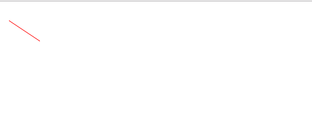
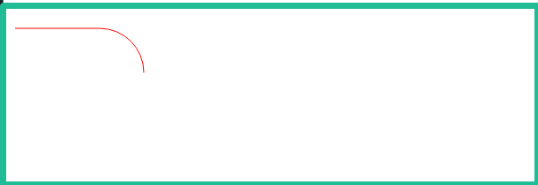
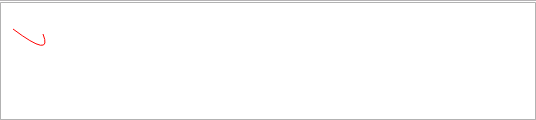
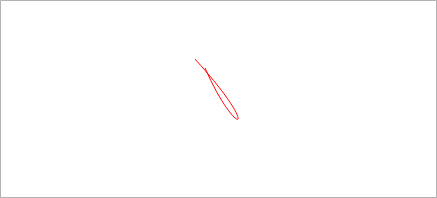
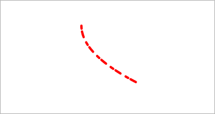
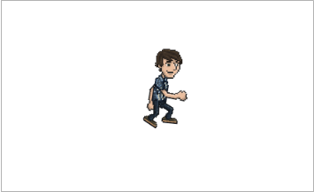

# easeljs

> EaselJS提供了一套完整的，层次化的互动方式，更简单的处理HTML5画布。所以首先要在html页面加入画布(canvas),并引入easeljs.js文件

```html
<!DOCTYPE html>
<html lang="en">

<head>
    <meta charset="UTF-8">
    <title>Document</title>
    <script src="../lib/easeljs.js"></script>
</head>

<body>
    <canvas id="canvas"></canvas>
</body>

</html>
```

* * *

@toc

## Text

```javascript
/**
 * Text([text],[font],[color]) * [text] String optional:文本显示
 * [font] String optional:字体样式使用,对于css字体属性的任何有效
 * 值是可以接受的(如:"bold 36px Arial")
 * [color] String optional:文本颜色,对于css颜色属性的任何有效值是
 * 可以接受的(如:"#F00","red","#ff0000")
 */
var stage = new createjs.Stage("canvas");
var text = new createjs.Text("hello world", "20px arial", "#ff7700");
text.x = 100;
text.y = 100;
stage.addChild(text);
stage.update();
```

## Bitmap

```javascript
let stage = new createjs.Stage("canvas");
var bg = new createjs.Bitmap("../images/2.jpg");
stage.addChild(bg);
createjs.Ticker.addEventListener("tick", handleClick);

function handleClick(e) {
    bg.x = 1;
    console.log(bg.x)
    stage.update();
}
```

## AlphaMapFilter

```javascript
var stage = new createjs.Stage("canvas");
var box = new createjs.Shape();
box.graphics.beginLinearGradientFill(["#ff0000", "#0000ff"], [0, 1], 0, 0, 0, 100)
box.graphics.drawRect(0, 0, 100, 100);
box.cache(0, 0, 100, 100);

var bmp = new createjs.Bitmap("../images/2.jpg");
bmp.filters = [
    new createjs.AlphaMapFilter(box.cacheCanvas)
];
bmp.cache(0, 0, 100, 100);
stage.addChild(bmp);
stage.update();
```

## graphics

```javascript
/**直线
 * beginStroke(color) 
 */
var stage = new createjs.Stage("canvas");
var graphics = new createjs.Graphics();
graphics.beginStroke("#f00").moveTo(5, 20).lineTo(50, 50);
var shape = new createjs.Shape(graphics);
stage.addChild(shape);
stage.update();
```



```javascript
/**圆弧
 * arcTo(x1,y1,x2,y2,radius)
 */
var stage = new createjs.Stage("canvas");
var graphics = new createjs.Graphics();
graphics.beginStroke("#f00").moveTo(5, 20).arcTo(150, 20, 150, 70, 50);
var shape = new createjs.Shape(graphics);
stage.addChild(shape);
stage.update();
```



```javascript
/**
 * quadraticCurveTo(cpx,cpy,x,y)
 * 使用控制点（cpx，cpy）绘制从当前绘图点到（x，y）的二次曲线
 */

var stage = new createjs.Stage("canvas");
var graphics = new createjs.Graphics();
graphics.beginStroke("#f00").moveTo(5, 20).quadraticCurveTo(45, 50, 35, 25);
var shape = new createjs.Shape(graphics);
stage.addChild(shape);
stage.update();
```



```javascript
/**贝塞尔曲线
 * bezierCurveTo(cp1x,cp1y,cp2x,cp2y,x,y)
 * 使用控制点（cp1x，cp1y）和（cp2x，cp2y）
 * 绘制从当前绘图点到（x，y）的贝塞尔曲线
 */

var stage = new createjs.Stage("canvas");
var graphics = new createjs.Graphics();
graphics.beginStroke("#f00").moveTo(10, 10).bezierCurveTo(45, 90, 75, 75, -25, -25);
var shape = new createjs.Shape(graphics);
stage.addChild(shape)
stage.update();
```



```javascript
/**
 * setStrokeStyle(thickness,[caps=0],[joints=0],[miterLimit=10],[ignoreScale=false]);
 * thickness:笔画的宽度
 * [caps=0]:指示在行尾使用大写字母类型,对接,圆形或方形之一
 * [joints=0]:指定两条线相交时应使用的关节类型,斜面.圆形或斜角之一
 * [miterLimit=10]:如果关节设置为"斜接",则可以指定斜接限制比率
 * [ignoreScale=false]:如果为true,则无论活动如何变化,都将以指定的厚度绘制笔画
 */
/**
 * setStrokeDash([segments], [offset=0])
 * 设置或清除笔划虚线图案。
 * [segments] 数组 可选
 *指定虚线图案的数组，在线和间隙之间交替。例如，[20,10]将创建一条20像素线的图案，它们之间有10个像素间隙。传递null或空数组将清除现有的笔划短划线。
 *[offset=0] 数字 可选
 *虚线图案的偏移量。例如，您可以增加此值以创建“行进蚂蚁”效果
 * */

var stage = new createjs.Stage("canvas");
var graphics = new createjs.Graphics();
graphics.beginStroke("#f00").setStrokeStyle(4, "round", "bevel", "round")
    .setStrokeDash([5, 5, 10, 10])
    .moveTo(25, 25).quadraticCurveTo(25, 75, 125, 125).endStroke();
var shape = new createjs.Shape(graphics);
stage.addChild(shape)
stage.update();
```



- 以下引用easeljs中的代码片段

```javascript
//封装了graphics的常用操作
{
    label: 'drawRect();',
    graphics: function() {
        return new Graphics().beginFill(FILL_COLOR).rect(5, 5, 80, 80);
    }
}, {
    label: 'drawRoundRect();',
    graphics: function() {
        return new Graphics().beginFill(FILL_COLOR)
            .drawRoundRect(0, 0, 120, 120, 5);
    }
}, {
    label: 'beginLinearGradientFill() with drawRoundRect();',
    graphics: function() {
        return new Graphics().beginLinearGradientFill([FILL_COLOR, STROKE_COLOR], [0, 1], 0, 0, 0, 130)
            .drawRoundRect(0, 0, 120, 120, 5);
    }
}, {
    label: 'drawCircle();',
    graphics: function() {
        return new Graphics().beginFill(FILL_COLOR).drawCircle(40, 40, 40);
    }
}, {
    label: 'beginRadialGradientFill() with drawCircle();',
    graphics: function() {
        return new Graphics().beginRadialGradientFill([FILL_COLOR, STROKE_COLOR], [0, 1], 40, 40, 0, 40, 40, 40)
            .drawCircle(40, 40, 40);
    }
}, {
    label: 'drawEllipse();',
    graphics: function() {
        return new Graphics().beginFill(FILL_COLOR)
            .drawEllipse(5, 5, 60, 120);
    }
}, {
    label: 'Draw Hexagon using drawPolyStar();',
    graphics: function() {
        return new Graphics().beginFill(FILL_COLOR)
            .drawPolyStar(60, 60, 60, 6, 0, 45);
    }
}, {
    label: 'Draw a star using drawPolyStar();',
    graphics: function() {
        return new Graphics().beginFill(FILL_COLOR)
            .drawPolyStar(80, 80, 70, 5, 0.6, -90);
    }
}, {
    label: 'beginBitmapStroke() with drawRect();',
    graphics: function() {
        return new Graphics().setStrokeStyle(25)
            .beginBitmapStroke(img).rect(5, 5, 100, 100);
    }
}, {
    label: 'drawRoundRectComplex();',
    graphics: function() {
        return new Graphics().beginFill(FILL_COLOR)
            .drawRoundRectComplex(5, 5, 70, 70, 5, 10, 15, 25);
    }
}, {
    label: 'drawCircle(); with beginBitmapFill();',
    graphics: function() {
        return new Graphics().beginStroke(STROKE_COLOR)
            .beginBitmapFill(img).drawCircle(30, 30, 30);
    }
```

## sprite

```javascript
var stage = new createjs.Stage("canvas");
var ss = new createjs.SpriteSheet({
    "animations": {
        "run": [0, 25, "jump", 2],
        "jump": [26, 63, "run"]
    },
    "images": ["../images/spritesheet_grant.png"],
    "frames": {
        "regX": 0,
        "regY": 0,
        "height": 293,
        "width": 166,
        "count": 64
    }
});

var sprite = new createjs.Sprite(ss, "run");
sprite.scale = 0.4;
stage.addChild(sprite);

createjs.Ticker.addEventListener("tick", stage);
stage.update();
```


# createjsDemo
